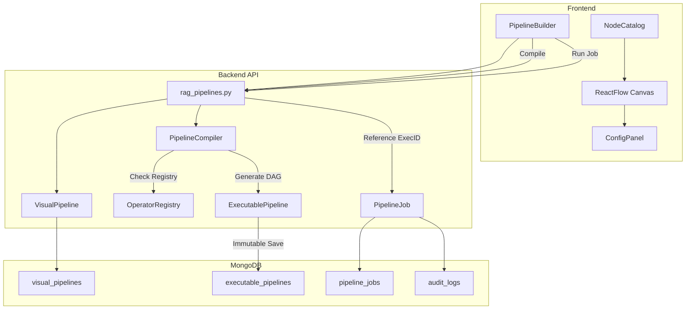

# Visual Pipeline Builder Implementation

## Overview

Build a visual UI using React Flow where admins can drag and drop RAG operators to create custom pipelines. The system separates the visual representation from the execution logic through a compilation step into an **immutable** execution graph.

---

## Architecture



---

## Backend Changes

### 1. Extended Models ([backend/app/db/models/rag.py](backend/app/db/models/rag.py))

```python
class PipelineNode(BaseModel):
    id: str
    category: str  # "source", "transform", "embedding", "storage"
    operator: str  # "s3_loader", "recursive_chunker", etc.
    position: Dict[str, float]
    config: Dict[str, Any] = {}

class VisualPipeline(MongoModel):
    tenant_id: PyObjectId
    org_unit_id: Optional[PyObjectId]
    name: str
    description: Optional[str] = None
    nodes: List[PipelineNode] = []
    edges: List[dict] = []
    version: int = 1
    is_published: bool = False
    created_at: datetime
    updated_at: datetime

class ExecutableStep(BaseModel):
    step_id: str
    operator: str
    config: Dict[str, Any]
    depends_on: List[str]

class ExecutablePipeline(MongoModel):
    visual_pipeline_id: PyObjectId
    version: int
    tenant_id: PyObjectId
    dag: List[ExecutableStep]  # Structured DAG
    config_snapshot: Dict[str, Any]
    is_valid: bool = True
    created_at: datetime
    # CRITICAL: No Update endpoints allowed for this model.

class PipelineJob(MongoModel):
    tenant_id: PyObjectId
    executable_pipeline_id: PyObjectId
    status: str  # queued, running, failed, completed
    started_at: Optional[datetime]
    finished_at: Optional[datetime]
    triggered_by: str  # user_id
    input_params: Dict[str, Any]
    logs_ref: Optional[str]
```

### 2. Operator Registry ([backend/app/rag/pipeline/registry.py](backend/app/rag/pipeline/registry.py))

Define contracts for all supported operators:

- `OperatorSpec`: ID, Category, InputType, OutputType, ConfigSchema.

### 3. Pipeline Compiler ([backend/app/rag/pipeline/compiler.py](backend/app/rag/pipeline/compiler.py))

- Validates graph against `OperatorSpec`.
- Ensures semantic consistency (e.g., Embedder dimension == Vector Store dimension).
- Produces the immutable `ExecutablePipeline` with an ordered `dag`.

---

## Frontend Changes

### 1. Guarded React Flow UI

- **Connection Rules:** Only allow connections between compatible handles (e.g., Source Output -> Transform Input).
- **Inline Validation:** Highlight nodes missing required configuration according to `OperatorSpec`.

### 2. Execution & Jobs

- **Job Launcher:** Dialog to select a compiled version and trigger a `PipelineJob`.
- **Job Monitor:** UI to view the status and logs of a specific job, referencing its immutable `ExecutablePipeline`.

---

## Auditing & Security

- **Immutability:** Once a pipeline version is compiled, its `ExecutablePipeline` record cannot be changed. Rollbacks simply point to a previous ID.
- **RBAC:** All operations filtered by `tenant_id` and authorized against `org_unit_id`.
- **Audit Logs:** Every job execution logs the specific `executable_pipeline_id` used for 100% reproducibility.