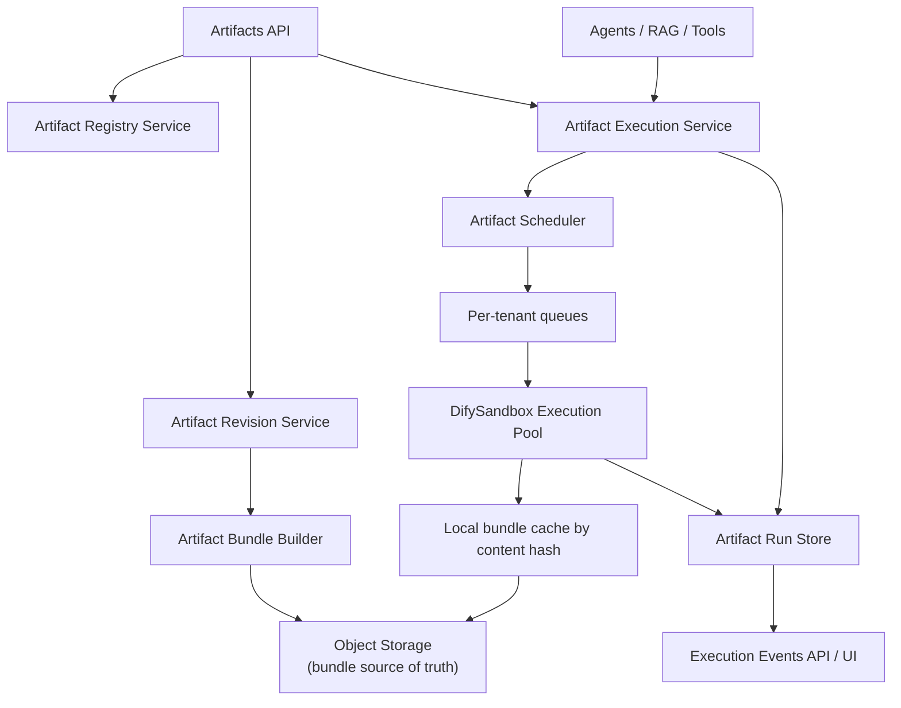

Last Updated: 2026-03-10

# Artifact Execution Architecture (DifySandbox)

## Purpose

This document defines the target backend architecture for tenant-authored artifact execution.

It replaces the current in-process artifact execution model with a centralized execution layer built on an internal DifySandbox pool.

This spec covers:
- artifact revisions and bundles
- execution services and runtime boundaries
- test-run execution from the Artifacts page
- live execution from Agents, RAG pipelines, and Tools
- run records, events, and observability
- migration from the current artifact architecture

## Why This Exists

The current artifact architecture is not suitable for large-scale multi-tenant SaaS execution because tenant-authored Python code is still treated too much like local platform code.

Current problems:
- tenant artifacts are still executed in-process in some paths
- artifact discovery is filesystem-first instead of revision-first
- draft/test execution and production execution do not share a single hardened runtime contract
- there is no dedicated artifact execution control plane with per-run records, scheduling, and fairness

## Current Implementation Status

As of 2026-03-10, the V1 foundation from this spec has been partially implemented:
- tenant artifact CRUD now targets revision-backed runtime tables
- test runs can execute through the new artifact run model and internal worker path
- Celery-backed artifact test-run orchestration exists with a direct/local execution mode for repo tests
- builtin repo artifacts remain compatibility-read-only and are not migrated into runtime tables yet

Still pending from the broader vision:
- live agent, tool, and RAG execution on the new runtime
- full externalized DifySandbox worker deployment/runtime hardening
- frontend polling migration away from the legacy synchronous compatibility test endpoint

## Goals

- isolate tenant-authored artifact execution from the main backend process
- use the same execution substrate for test runs and production runs
- support low-latency live execution for agent, tool, and RAG hot paths
- pin production runs to immutable published revisions
- make artifact execution auditable, observable, and schedulable
- keep domain integrations thin so execution logic stays centralized

## Non-Goals

- replacing App Builder Sprite runtime
- building a fully general container platform
- supporting mutable "latest" artifact execution in production
- running tenant artifact code directly inside shared backend workers

## Core Decisions

1. Tenant-authored artifacts execute through a shared Artifact Execution Service.
2. The execution backend is an internal DifySandbox pool behind a scheduler and load balancer.
3. Production execution always uses a published, immutable artifact revision.
4. Draft revisions can run only in test mode.
5. Test runs and production runs use the same execution substrate and runtime contract.
6. Agents, RAG pipelines, and Tools never execute artifact code directly; they only call the shared execution layer.

## High-Level Architecture



## Runtime Substrate

### DifySandbox Pool

The execution primitive is a horizontally scalable pool of DifySandbox workers.

Each worker:
- runs as an internal service inside Talmudpedia infrastructure
- accepts execution requests from the Artifact Execution Service
- fetches artifact bundles from object storage on cache miss
- executes artifact code in a DifySandbox-isolated subprocess
- returns structured result payloads plus stdout/stderr and execution metadata

The worker pool is stateless with respect to scheduling. Bundles are cached locally by content hash and can be re-fetched at any time from object storage.

### Queueing and Fairness

Execution requests must pass through a scheduler that enforces:
- per-tenant fairness
- priority separation between production interactive traffic and test traffic
- backpressure when workers are saturated

Recommended queue classes:
- `prod_interactive`
- `prod_background`
- `test`

Recommended policy:
- `prod_interactive` has highest priority
- test runs can be throttled more aggressively
- no tenant may occupy the entire available worker pool

## Artifact Model

Artifacts must become revision-first backend assets rather than filesystem-first assets.

### Artifact

Mutable logical identity.

Fields:
- `id`
- `tenant_id`
- `slug`
- `display_name`
- `scope`
- `status`
- `latest_draft_revision_id`
- `latest_published_revision_id`
- `created_by`
- `created_at`
- `updated_at`

### ArtifactRevision

Immutable executable snapshot.

Fields:
- `id`
- `artifact_id`
- `tenant_id`
- `version_label`
- `manifest_json`
- `bundle_storage_key`
- `bundle_hash`
- `dependency_hash`
- `is_published`
- `created_by`
- `created_at`

Rules:
- published revisions are immutable
- production execution may reference only published revisions
- draft revisions may be replaced by creating a new revision, not mutating an existing one

### ArtifactRun

One execution attempt.

Fields:
- `id`
- `tenant_id`
- `artifact_id`
- `revision_id`
- `domain`
- `status`
- `queue_class`
- `sandbox_backend`
- `worker_id`
- `sandbox_session_id`
- `input_payload`
- `config_payload`
- `context_payload`
- `result_payload`
- `error_payload`
- `stdout_excerpt`
- `stderr_excerpt`
- `started_at`
- `finished_at`
- `duration_ms`

### ArtifactRunEvent

Structured event stream for one run.

Fields:
- `id`
- `run_id`
- `sequence`
- `timestamp`
- `event_type`
- `payload`

## Bundle Format

Tenant artifacts are executed from immutable bundles stored in object storage.

Each bundle should contain:
- `artifact.json` or equivalent normalized manifest snapshot
- `handler.py`
- vendored dependencies
- runtime metadata

Requirements:
- no `pip install` during execution
- bundle content is immutable once published
- workers cache bundles locally by content hash
- cache invalidation is hash-driven, not name-driven

Important design choice:
- object storage is the source of truth
- worker-local cache is an optimization
- avoid shared mounted volumes as the primary runtime dependency

## Execution Contract

Every artifact handler must implement:

```python
async def execute(inputs: dict, config: dict, context: dict) -> dict:
    ...
```

The execution layer passes:

- `inputs`: resolved structured inputs for the artifact
- `config`: artifact config payload
- `context`: runtime context controlled by the platform

`context` must include:
- `tenant_id`
- `artifact_id`
- `revision_id`
- `run_id`
- `domain`
- `resource_limits`
- `principal_id` when applicable
- `initiator_user_id` when applicable
- trace identifiers

The artifact code must return JSON-serializable output only.

## Backend Services

### ArtifactRegistryService

Responsibilities:
- resolve artifact identity
- enforce scope and tenant ownership
- resolve draft vs published revision rules
- expose builtin compatibility reads while builtin artifacts remain repo-backed

### ArtifactRevisionService

Responsibilities:
- create draft revisions
- create ephemeral revisions for unsaved test runs
- publish revisions
- load pinned revisions
- enforce revision immutability rules

### ArtifactBundleBuilder

Responsibilities:
- turn a revision snapshot into an immutable runtime bundle
- compute bundle hash and dependency hash
- normalize manifest content for runtime use

### ArtifactBundleStorage

Responsibilities:
- write bundles to object storage
- read bundles by storage key
- keep object storage as the durable bundle source of truth

### ArtifactExecutionService

Responsibilities:
- validate execution requests
- create run records
- assign queue class and runtime policy
- enqueue work
- expose run state and cancellation

### ArtifactRunService

Responsibilities:
- persist run lifecycle transitions
- persist ordered events
- store stdout/stderr excerpts
- store terminal results and failures

### DifySandbox Worker Client

Responsibilities:
- communicate with the internal worker service or execution pool
- submit execution payloads
- propagate cancellation

## Worker Responsibilities

Each DifySandbox worker should:
- accept authenticated internal execution requests
- fetch artifact bundles by hash or storage key
- populate local bundle cache on miss
- execute the artifact via the runtime runner
- emit structured result, logs, and events
- enforce per-run resource limits

## Scheduling Model

The scheduler should decide:
- which queue class the run belongs to
- which tenant budget applies
- whether the request can execute immediately or must wait

Recommended v1 queue classes:
- `artifact_prod_interactive`
- `artifact_prod_background`
- `artifact_test`

Initial usage:
- `artifact_test` for artifact-page test runs
- later phases extend the same service to Agents, RAG, and Tools

## Test Run Flow

The artifact development page must use the same runtime substrate as production execution.

Flow:
1. user edits an artifact
2. backend resolves the latest draft revision or materializes an ephemeral draft revision from unsaved code
3. backend creates an `ArtifactRun`
4. execution request goes through the scheduler
5. worker fetches or reuses the bundle
6. worker executes the artifact in DifySandbox
7. backend stores logs, events, result, and timing
8. UI polls run status and events endpoints

Important rule:
- no separate local test executor should exist outside this runtime path

## Production Domain Integrations

### Agents

Agent graph compilation should pin artifact revision ids.

At runtime:
- agent executor delegates to `ArtifactExecutionService`
- artifact result is mapped back into agent state
- events are recorded through the shared run/event path

### RAG Pipelines

Artifact-backed operators should be compiled with pinned revision ids.

At runtime:
- pipeline executor delegates to `ArtifactExecutionService`
- each operator run is isolated from the main backend process

### Tools

Artifact-backed tools should become thin wrappers over artifact execution.

At runtime:
- tool resolves published revision id
- tool executor delegates entirely to `ArtifactExecutionService`

## Security Model

Tenant-authored artifact code must not run directly inside the shared backend process.

Required controls:
- isolated execution boundary
- timeout limits
- memory and CPU limits
- restricted filesystem access
- restricted environment exposure
- network policy controls where applicable
- no cross-tenant runtime reuse without strict isolation guarantees

## Current Migration Plan

### Phase 1

Deliver:
- revision-backed tenant artifacts
- bundle builder and bundle storage
- run records and events
- artifact-page test runs on the new runtime

### Phase 2

Deliver:
- tool execution on the new runtime

### Phase 3

Deliver:
- agent artifact-node execution on the new runtime

### Phase 4

Deliver:
- RAG artifact-operator execution on the new runtime

### Phase 5

Deliver:
- broader runtime hardening
- externalized DifySandbox deployment
- scheduling and fairness improvements

## Relationship To Current Docs

This file is the future-state architecture and migration design note.

Current implementation/reference docs:
- [backend/documentations/artifacts_spec.md](/Users/danielbenassaya/Code/personal/talmudpedia/backend/documentations/artifacts_spec.md)
- [backend/documentations/artifacts_execution_infra_spec.md](/Users/danielbenassaya/Code/personal/talmudpedia/backend/documentations/artifacts_execution_infra_spec.md)

Use the docs this way:
- `artifacts_spec.md`: canonical current artifact domain spec
- `artifacts_execution_infra_spec.md`: current runtime/infra implementation status
- `artifact_execution_architecture_difysandbox_spec.md`: target-state architecture and migration plan
