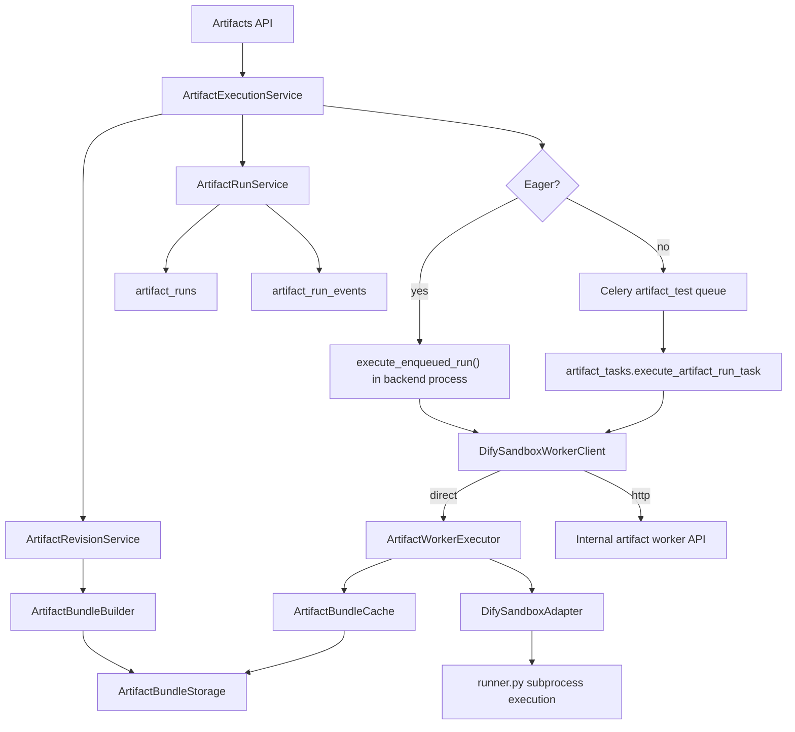

Last Updated: 2026-03-10

# Artifacts Execution Infra Spec

## Purpose

This document describes the current execution infrastructure for tenant artifact test runs and the target DifySandbox-oriented execution shape that the backend is moving toward.

This is the execution-focused companion to:
- [backend/documentations/artifacts_spec.md](/Users/danielbenassaya/Code/personal/talmudpedia/backend/documentations/artifacts_spec.md)

## Current Status

The current implementation is a V1 execution foundation, not the fully externalized final runtime.

Implemented today:
- revision-backed tenant artifacts
- immutable bundle generation per revision
- artifact run and event persistence
- Celery-backed `artifact_test` queue
- internal artifact worker execution path
- local bootstrap that can auto-start the artifact queue worker when the backend starts

Not fully implemented yet:
- live agent execution on this runtime
- live RAG execution on this runtime
- live tool execution on this runtime
- a separately deployed DifySandbox container pool
- hardened worker scheduling and fairness beyond the current V1 queueing shape

## Critical Implementation Truth

The code uses a `DifySandboxAdapter` boundary, but the current implementation behind that boundary is still local subprocess execution through the Python runner.

That means:
- the architecture is pointed at DifySandbox
- the execution contract is already centralized
- the current local implementation is still transitional

This is important because older design notes can easily overstate the current runtime maturity if they are read as fully implemented.

## Current Source Of Truth

- [backend/app/services/artifact_runtime/execution_service.py](/Users/danielbenassaya/Code/personal/talmudpedia/backend/app/services/artifact_runtime/execution_service.py)
- [backend/app/services/artifact_runtime/run_service.py](/Users/danielbenassaya/Code/personal/talmudpedia/backend/app/services/artifact_runtime/run_service.py)
- [backend/app/services/artifact_runtime/revision_service.py](/Users/danielbenassaya/Code/personal/talmudpedia/backend/app/services/artifact_runtime/revision_service.py)
- [backend/app/services/artifact_runtime/bundle_builder.py](/Users/danielbenassaya/Code/personal/talmudpedia/backend/app/services/artifact_runtime/bundle_builder.py)
- [backend/app/services/artifact_runtime/bundle_storage.py](/Users/danielbenassaya/Code/personal/talmudpedia/backend/app/services/artifact_runtime/bundle_storage.py)
- [backend/app/services/artifact_runtime/difysandbox_client.py](/Users/danielbenassaya/Code/personal/talmudpedia/backend/app/services/artifact_runtime/difysandbox_client.py)
- [backend/app/workers/artifact_tasks.py](/Users/danielbenassaya/Code/personal/talmudpedia/backend/app/workers/artifact_tasks.py)
- [backend/app/workers/celery_app.py](/Users/danielbenassaya/Code/personal/talmudpedia/backend/app/workers/celery_app.py)
- [backend/app/artifact_worker/executor.py](/Users/danielbenassaya/Code/personal/talmudpedia/backend/app/artifact_worker/executor.py)
- [backend/app/artifact_worker/bundle_cache.py](/Users/danielbenassaya/Code/personal/talmudpedia/backend/app/artifact_worker/bundle_cache.py)
- [backend/app/artifact_worker/difysandbox_adapter.py](/Users/danielbenassaya/Code/personal/talmudpedia/backend/app/artifact_worker/difysandbox_adapter.py)
- [backend/app/artifact_worker/runner.py](/Users/danielbenassaya/Code/personal/talmudpedia/backend/app/artifact_worker/runner.py)
- [backend/main.py](/Users/danielbenassaya/Code/personal/talmudpedia/backend/main.py)

## Execution Architecture



## Runtime Flow

### 1. Run creation

The API creates a test run through `ArtifactExecutionService.start_test_run()`.

That method:
- resolves an existing draft revision or creates an ephemeral revision from unsaved code
- creates an `artifact_runs` row
- adds initial queued events
- commits the run
- dispatches execution eagerly or through Celery

### 2. Dispatch

Dispatch behavior is controlled by `ARTIFACT_RUN_TASK_EAGER`.

- eager mode:
  - execute immediately in the backend process
- queued mode:
  - enqueue `app.workers.artifact_tasks.execute_artifact_run_task`
  - consume it from the `artifact_test` queue

### 3. Worker client mode

The worker client supports two modes.

#### Direct mode

Default local development path.

Behavior:
- backend or Celery task instantiates `ArtifactWorkerExecutor` directly
- no separate worker HTTP service is required

Selection:
- `ARTIFACT_WORKER_CLIENT_MODE=direct`
- or no base URL configured

#### HTTP mode

Internal service path for a separately deployed worker process.

Behavior:
- sends an internal authenticated request to the worker API

Selection:
- `ARTIFACT_WORKER_CLIENT_MODE=http`
- or `ARTIFACT_WORKER_BASE_URL` is set

## Current Worker Runtime

### ArtifactWorkerExecutor

Responsibilities:
- load the target revision
- resolve the bundle payload through cache/storage
- execute the bundle through the DifySandbox adapter
- normalize stdout/stderr/result/error into the worker response contract
- emit ordered execution events

### Bundle cache

`ArtifactBundleCache` stores extracted bundles under:
- `ARTIFACT_WORKER_BUNDLE_CACHE_DIR`
- default: `/tmp/talmudpedia-artifact-runtime-cache`

Cache key:
- `bundle_hash`

Current payload sources:
- inline bytes stored on `artifact_revisions.bundle_inline_bytes`
- object storage through `ArtifactBundleStorage`

### Bundle storage

`ArtifactBundleStorage` reuses the published-app bundle storage pattern.

Current behavior:
- prefers `ARTIFACT_BUNDLE_*`
- falls back to `APPS_BUNDLE_*`
- writes bundle zip payloads under `artifacts/runtime-bundles/...`

### DifySandbox adapter

Current implementation behavior:
- writes a JSON request file
- launches a subprocess running `runner.py`
- waits for a JSON result file
- captures stdout and stderr
- kills the subprocess on timeout

So today the adapter is functioning as an execution boundary abstraction, but it is not yet a true DifySandbox pool client.

## Current Bundle Format

The V1 bundle currently contains:
- `artifact.json`
- `handler.py`

Generated from:
- revision metadata
- revision source code

Current constraints:
- no runtime `pip install`
- no native dependency setup
- no multi-file artifact package model yet

## Handler Contract

Canonical runtime contract:

```python
async def execute(inputs: dict, config: dict, context: dict) -> dict:
    ...
```

Transition compatibility:
- the worker runner also supports older single-context artifact handlers so existing code can still test during migration

## Run Records And Events

Every execution persists:
- run metadata
- final status
- result or error payload
- stdout/stderr excerpts
- ordered events

Current run statuses:
- `queued`
- `running`
- `completed`
- `failed`
- `cancel_requested`
- `cancelled`

Current event shape is aligned with the shared execution-event style already used elsewhere in the backend:
- `event_type`
- `payload.ts`
- `payload.event`
- `payload.name`
- `payload.data`
- `payload.source_run_id`

Typical events:
- `run_queued`
- `run_started`
- `stdout`
- `stderr`
- `run_completed`
- `run_failed`
- `run_cancel_requested`
- `run_cancelled`

## Queueing

Celery currently defines:
- `artifact_prod_interactive`
- `artifact_prod_background`
- `artifact_test`

Current V1 usage:
- only `artifact_test` is active for actual artifact execution

## Local Backend Bootstrap

The backend now auto-bootstraps artifact test execution in local development.

Current startup behavior in [backend/main.py](/Users/danielbenassaya/Code/personal/talmudpedia/backend/main.py):
- default artifact worker mode to `direct` if unset
- default eager mode to `0` if unset
- auto-start a dedicated Celery worker for `artifact_test` when local infra bootstrap is enabled

This means local development normally needs only:

```bash
cd backend
uvicorn main:app --reload --host 0.0.0.0 --port 8000
```

Assuming Redis is available locally, artifact test runs can now execute without separately starting an artifact worker service by hand.

## Current Env Vars

Most relevant current env vars:
- `ARTIFACT_RUNTIME_AUTO_BOOTSTRAP`
- `ARTIFACT_WORKER_CLIENT_MODE`
- `ARTIFACT_WORKER_BASE_URL`
- `ARTIFACT_WORKER_INTERNAL_TOKEN`
- `ARTIFACT_RUN_TASK_EAGER`
- `ARTIFACT_CELERY_LOG_PATH`
- `ARTIFACT_WORKER_BUNDLE_CACHE_DIR`
- `ARTIFACT_BUNDLE_BUCKET`
- `ARTIFACT_BUNDLE_REGION`
- `ARTIFACT_BUNDLE_ENDPOINT`
- `ARTIFACT_BUNDLE_ACCESS_KEY`
- `ARTIFACT_BUNDLE_SECRET_KEY`

Fallback bundle envs:
- `APPS_BUNDLE_BUCKET`
- `APPS_BUNDLE_REGION`
- `APPS_BUNDLE_ENDPOINT`
- `APPS_BUNDLE_ACCESS_KEY`
- `APPS_BUNDLE_SECRET_KEY`

## Current Limitations

- no true external DifySandbox container pool yet
- no production-grade per-tenant scheduler yet
- no artifact production traffic on `artifact_prod_interactive` or `artifact_prod_background` yet
- no fully packaged dependency-vendoring workflow yet beyond the current simple bundle format
- current local bootstrap is aimed at developer convenience, not final deployment topology

## Target Direction

The target direction remains:
- one shared artifact execution service
- DifySandbox as the isolation boundary for tenant artifact code
- published revision pinning for production execution
- thin agent/rag/tool integrations over the same execution substrate
- stronger queueing, fairness, and worker isolation once live domain traffic is moved onto this stack
