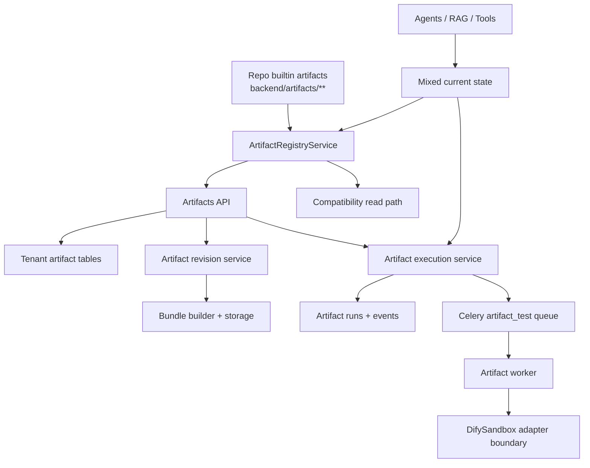

Last Updated: 2026-03-10

# Artifacts Spec

## Purpose

This is the canonical current-state spec for the artifact domain in Talmudpedia.

It replaces the older split across:
- `adding_new_operators.md`
- `code_artifacts_architecture_v1.md`
- `rag_custom_operators.md`
- the artifact-domain portions of the older execution design note

This file covers:
- what artifacts are used for across the platform
- the current storage and execution architecture
- builtin versus tenant artifacts
- the current artifact data model and configuration fields
- authoring, test, and publish lifecycle
- current limitations and migration direction

## Scope

This file is about the tenant code-artifact domain used by:
- Agents
- RAG pipelines
- Tools
- the admin Artifacts page

It does not describe the separate frontend "React artifact preview" chat feature.

## Current Source Of Truth

The current backend implementation is primarily in:
- [backend/app/api/routers/artifacts.py](/Users/danielbenassaya/Code/personal/talmudpedia/backend/app/api/routers/artifacts.py)
- [backend/app/api/routers/artifact_runs.py](/Users/danielbenassaya/Code/personal/talmudpedia/backend/app/api/routers/artifact_runs.py)
- [backend/app/api/schemas/artifacts.py](/Users/danielbenassaya/Code/personal/talmudpedia/backend/app/api/schemas/artifacts.py)
- [backend/app/db/postgres/models/artifact_runtime.py](/Users/danielbenassaya/Code/personal/talmudpedia/backend/app/db/postgres/models/artifact_runtime.py)
- [backend/app/services/artifact_runtime/](/Users/danielbenassaya/Code/personal/talmudpedia/backend/app/services/artifact_runtime/)
- [backend/app/services/artifact_registry.py](/Users/danielbenassaya/Code/personal/talmudpedia/backend/app/services/artifact_registry.py)
- [backend/app/artifact_worker/](/Users/danielbenassaya/Code/personal/talmudpedia/backend/app/artifact_worker/)
- [backend/alembic/versions/c4b2f6a9d1e0_add_artifact_runtime_v1.py](/Users/danielbenassaya/Code/personal/talmudpedia/backend/alembic/versions/c4b2f6a9d1e0_add_artifact_runtime_v1.py)

## What Artifacts Are

Artifacts are reusable units of platform logic authored in Python and consumed by multiple domains.

They exist so the platform can expose custom executable behavior without hardcoding every operator, tool, or node into the backend source tree.

Current platform uses:
- RAG custom processing logic
- Agent graph nodes
- Artifact-backed tools
- builtin platform utility artifacts, such as the Platform SDK artifact

## Why The Platform Needs Them

Artifacts are the shared extension mechanism across the product.

They provide:
- a single authoring model for custom code
- declarative metadata for display and validation
- a structured contract for inputs, outputs, reads, writes, and config
- revision-aware execution for tenant-authored logic
- run records for test executions

Without artifacts, each domain would need a separate plugin mechanism.

## Current Architecture

Today the artifact domain is hybrid.

Repo-backed builtin artifacts still exist under `backend/artifacts/` and are discovered through the legacy filesystem registry.

Tenant artifacts now use the new runtime tables and revision model.

Test execution for tenant artifacts now goes through the new artifact runtime layer and worker path.

Live agent/tool/RAG execution has not yet been migrated to the new runtime everywhere, so the overall system is in transition.



## Artifact Classes

### 1. Builtin repo artifacts

These are filesystem-backed artifacts stored under `backend/artifacts/`.

Current role:
- platform-owned logic
- compatibility read path
- still discovered through [artifact_registry.py](/Users/danielbenassaya/Code/personal/talmudpedia/backend/app/services/artifact_registry.py)

Important status:
- they are not migrated into the runtime revision tables in V1
- they are effectively read-only from the admin CRUD perspective

### 2. Tenant artifacts

These are the new first-class artifacts for the platform.

They are stored in:
- `artifacts`
- `artifact_revisions`
- `artifact_runs`
- `artifact_run_events`

Tenant artifacts are now revision-backed and testable through the shared runtime path.

## Current Data Model

### Artifact

Logical identity for a tenant artifact.

Current fields include:
- `id`
- `tenant_id`
- `slug`
- `display_name`
- `description`
- `category`
- `scope`
- `input_type`
- `output_type`
- `status`
- `latest_draft_revision_id`
- `latest_published_revision_id`
- `created_by`
- `created_at`
- `updated_at`

### ArtifactRevision

Executable snapshot of one artifact version.

Current fields include:
- `id`
- `artifact_id`
- `tenant_id`
- `display_name`
- `description`
- `category`
- `scope`
- `input_type`
- `output_type`
- `source_code`
- `config_schema`
- `inputs`
- `outputs`
- `reads`
- `writes`
- `version_label`
- `is_published`
- `is_ephemeral`
- `bundle_hash`
- `bundle_storage_key`
- `bundle_inline_bytes`
- `manifest_json`
- `created_by`
- `created_at`

### ArtifactRun

One execution attempt.

Current fields include:
- `id`
- `tenant_id`
- `artifact_id`
- `revision_id`
- `domain`
- `status`
- `queue_class`
- `sandbox_backend`
- `worker_id`
- `sandbox_session_id`
- `cancel_requested`
- `input_payload`
- `config_payload`
- `context_payload`
- `result_payload`
- `error_payload`
- `stdout_excerpt`
- `stderr_excerpt`
- `started_at`
- `finished_at`
- `duration_ms`

### ArtifactRunEvent

Ordered event stream for a run.

Current fields include:
- `id`
- `run_id`
- `sequence`
- `event_type`
- `payload`
- `created_at`

## Artifact Configuration Shape

The admin/API artifact shape currently exposes these top-level fields:
- `id`
- `name`
- `display_name`
- `description`
- `category`
- `input_type`
- `output_type`
- `version`
- `type`
- `scope`
- `author`
- `tags`
- `created_at`
- `updated_at`
- `python_code`
- `path`
- `reads`
- `writes`
- `inputs`
- `outputs`
- `config_schema`

### `config_schema`

Each config field may contain:
- `name`
- `type`
- `label`
- `required`
- `default`
- `description`
- `options`
- `placeholder`

### `inputs`

Each input may contain:
- `name`
- `type`
- `required`
- `default`
- `description`

### `outputs`

Each output may contain:
- `name`
- `type`
- `description`

### `reads` and `writes`

These describe which state or execution fields the artifact expects to consume or mutate.

## Current Lifecycle

### Draft authoring

Tenant artifacts are created and edited through the admin artifacts API.

The current CRUD path writes tenant artifacts into the revision-backed runtime tables, not into `custom_operators` and not into filesystem artifact folders.

### Test execution

Artifact page test runs now use the shared artifact runtime path:
1. resolve latest draft or materialize an ephemeral draft revision
2. create an `artifact_runs` row
3. enqueue or eagerly execute the run
4. execute through the internal artifact worker
5. persist result, logs, and events

Current run endpoints:
- `POST /admin/artifacts/test-runs`
- `POST /admin/artifacts/{artifact_id}/test-runs`
- `GET /admin/artifact-runs/{run_id}`
- `GET /admin/artifact-runs/{run_id}/events`
- `POST /admin/artifact-runs/{run_id}/cancel`

Compatibility endpoint:
- `POST /admin/artifacts/test`

That compatibility endpoint still exists, but it now routes through the same new run-based runtime.

### Publish

Publishing now means promoting the latest draft revision to the published revision pointer.

In V1, publishing does not create tenant filesystem artifacts.

## Execution Contract

The new runtime contract is:

```python
async def execute(inputs: dict, config: dict, context: dict) -> dict:
    ...
```

Compatibility note:
- the current worker runner also supports the older single-context artifact signature for existing code during the transition

## Current Platform Usage By Domain

### Artifacts page

Primary current runtime user of the new artifact execution stack.

Used for:
- create/edit draft artifacts
- trigger test runs
- inspect logs, events, outputs, and failures

### Tools

Artifacts are already part of the conceptual tool model, but full live tool execution through the new revision runtime is still a follow-up phase.

### Agents

Agent-side artifact usage exists, but live agent execution is not yet fully migrated to the new shared runtime everywhere.

### RAG pipelines

RAG custom logic is the historical origin of the feature, but live RAG execution still contains legacy paths and compatibility assumptions.

## Current Contradictions And Transitional Reality

This domain currently has some intentional overlap between legacy and new systems.

### 1. Filesystem versus revision-backed storage

Builtin artifacts are still repo-backed and scanned from disk.

Tenant artifacts are now revision-backed in Postgres.

### 2. Legacy operator language versus artifact language

Some older docs and code still use "custom operator" terminology, especially for RAG.

The current canonical domain term should be "artifact" for the shared system.

### 3. Scope model drift

The platform model already recognizes `tool` as an artifact scope in code and manifests.

Older docs and parts of the historical API language were narrower and focused on `rag` and `agent`.

### 4. Runtime migration is incomplete

Artifact-page testing is on the new runtime.

Full live execution for Agents, RAG, and Tools is not yet completely migrated to the same runtime service.

## Current Limitations

- builtin repo artifacts are not yet migrated into runtime revision tables
- live agent/tool/RAG execution is not yet uniformly routed through the new execution service
- the worker-side DifySandbox layer is currently an adapter boundary with local subprocess execution, not a full externalized DifySandbox pool
- v1 bundle building supports only the current pure-Python handler bundle shape
- the platform still carries some legacy custom-operator concepts and routes during migration

## Canonical Direction

The intended direction is:
- one artifact domain across Agents, RAG, and Tools
- tenant artifacts stored as immutable revisions
- test and production execution using one shared runtime contract
- execution isolated behind the artifact worker / DifySandbox boundary
- builtin artifacts eventually reconciled with the same broader model

## Companion Doc

The execution substrate and worker architecture are specified in:
- [backend/documentations/artifacts_execution_infra_spec.md](/Users/danielbenassaya/Code/personal/talmudpedia/backend/documentations/artifacts_execution_infra_spec.md)
