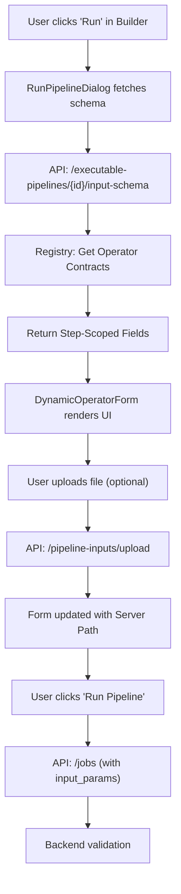

# Pipeline Input UI & Dynamic Forms

## Overview
The Pipeline Input UI feature replaces the generic JSON input dialog for running pipelines with a dynamic, operator-aware form system. It automatically discovers the required runtime parameters for a specific compiled pipeline and generates a user-friendly interface based on the operator's configuration schema.

## Core Features
- **Automatic Schema Discovery**: The system identifies "source" nodes in the execution graph and extracts configuration fields that haven't been statically set in the builder.
- **Type-Safe Inputs**: Generates specialized UI components for different field types (Strings, Integers, Booleans, Selects, Models, etc.).
- **Specialized File Upload**: Integrated file upload support for operators like `local_loader`, allowing users to upload files directly from the run dialog and automatically mapping them to the pipeline's file path requirements.
- **Namespaced Runtime Payload**: Runtime inputs are grouped by step to avoid collisions and keep inputs unambiguous.
- **Runtime Mutability**: Only fields explicitly marked as runtime-mutable are exposed in the run dialog.
- **Backend Validation**: Job creation validates runtime inputs against operator contracts with structured, field-level errors.
- **Improved UX**: Users no longer need to know the exact JSON structure of the input; the platform guides them through the required fields.
- **Retrieval Pipeline Support (NEW)**: Specialized handling for `query_input` nodes, supporting structured query objects (text, filters, top_k, alpha) instead of just raw file paths.

## Architecture

### Backend Components
1. **Input Schema Endpoint** (`GET /admin/pipelines/executable-pipelines/{exec_id}/input-schema`):
   - Inspects the `ExecutablePipeline` DAG.
   - Finds nodes with no dependencies (Source Nodes).
   - Cross-references the operator's `OperatorSpec` with the node's current `config`.
   - Returns step-scoped fields that require runtime values.

2. **File Upload Support** (`POST /admin/pipelines/pipeline-inputs/upload`):
   - A dedicated endpoint for temporary file storage.
   - Files are saved to a tenant-isolated directory using `PipelineInputStorage`.
   - Returns the absolute path plus an upload id for lifecycle management.

3. **Job Validation** (`POST /admin/pipelines/jobs`):
   - Rebuilds the runtime schema from the compiled pipeline.
   - Enforces required fields, type checks, enums, and managed upload existence.
   - Returns structured errors keyed by step and field.

### Frontend Components
1. **`ConfigFieldInput`**: A reusable dispatcher that renders the correct component for a given `ConfigFieldType`. Used in both the builder's `ConfigPanel` and the `RunPipelineDialog`.
2. **`DynamicOperatorForm`**: Orchestrates the rendering of the discovered schema, grouping fields by their respective steps.
3. **`FileUploadInput`**: A hybrid component that combines a text input with an upload button, handling the background upload and updating the form state with the resulting server path.
4. **`RunPipelineDialog`**: The main entry point that fetches the schema on-demand and submits the structured `input_params` to start a `PipelineJob`.

## Data Flow

## Integration Details
- **Custom Operators**: Custom operators defined with a `config_schema` are automatically supported by this system, allowing user-defined logic to have the same rich input experience as built-in operators.
- **Runtime Mutability**: Fields can be flagged as runtime-mutable to prevent overrides that change graph shape or execution contracts.
- **Validation**: Supports `required` flags, default values, enum constraints, and type checks in the backend with field-level errors.
- **Styling**: Uses the platform's minimalist design system (Shadcn/UI) with pastel category-themed headers in the form.
- **File Lifecycle**: Uploads are metadata-tracked and cleaned with a TTL-based sweep to prevent orphaned storage.
- **Structured Query Schema**: For retrieval pipelines, the `query_input` operator defines a specialized input schema that allows the UI to render fields for search filters and retrieval parameters (e.g., top_k, alpha) directly in the run dialog.
