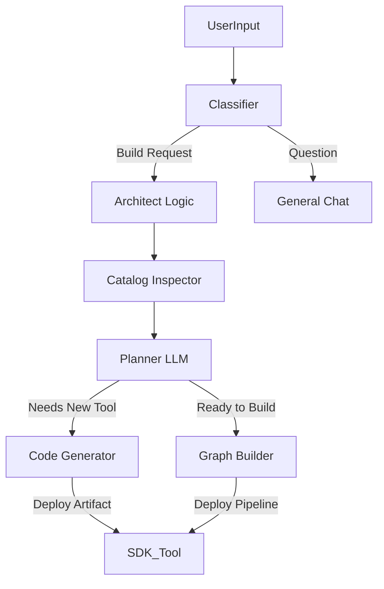

# Platform Architect Agent: Strategy & Design

## Vision
To build a "Meta-Agent" or "Architect Agent" capable of autonomously designing, building, and deploying RAG pipelines and Agents within the TalmudPedia platform. This agent serves as both a powerful feature for end-users and a proof-of-concept for the platform's extensibility ("Dogfooding").

## Core Philosophy
1.  **SaaS-Ready**: The agent must not rely on local filesystem access. It must operate entirely through the Platform APIs.
2.  **Self-Extending**: The agent should be able to write new Python code (via the SDK) to extend the platform's capabilities on the fly.
3.  **Introspective**: The agent uses the SDK to "see" what capabilities are available in the current environment.

## implementation Architecture

The Architect Agent is implemented **as a standard Agent** within the platform, utilizing a specialized "SDK Tool".

### 1. The "SDK Tool" (Core Artifact)
We will create a single, powerful Custom Artifact (`sdk_controller`) that wraps the Dynamic Python SDK. eliminating the need for the LLM to understand the raw REST API.

**Capabilities Exposed:**
- `fetch_catalog()`: Returns list of all available nodes (RAG & Agent).
- `create_custom_node(name, code)`: Uses `ArtifactBuilder` to register new logic.
- `deploy_rag_pipeline(graph_json)`: Deploys a RAG pipeline.
- `deploy_agent(graph_json)`: Deploys a new Agent.

### 2. The Agent Graph
The Architect Agent's graph will be designed as follows:

### 3. Step-by-Step "Dogfooding" Plan

#### Phase 1: The Core Tooling
1.  **Draft the Artifact**: Create a Python script `backend/artifacts/sdk_wrapper.py` that imports `backend.sdk` and exposes a `run()` function accepting commands (`list`, `create`, `deploy`).
2.  **Register as Tool**: Use the Platform Admin UI (or API) to register this artifact as a Tool named "Platform SDK".

#### Phase 2: The Agent Definition
1.  **Create Agent**: Create a new Agent "Talmud Architect".
2.  **Prompt Engineering**:
    *   *System Prompt:* "You are an expert Solutions Architect for the TalmudPedia platform. You have access to a verified SDK Tool that controls the platform..."
    *   *Instructions:* "Always check the catalog first. If a user needs X and it doesn't exist, write the Python code for X and deploy it using `create_custom_node`."

#### Phase 3: Validation (SaaS Proof)
1.  **Scenario**: "I want a pipeline that fetches stock prices from Yahoo Finance and summarizes them."
2.  **Execution**:
    *   Agent checks catalog -> No "Yahoo Finance Source".
    *   Agent writes `yahoo_finance_source.py` code.
    *   Agent calls `SDK_Tool.create_custom_node(...)`.
    *   Agent now sees "Yahoo Finance Source" in catalog.
    *   Agent builds pipeline connecting `YahooReader` -> `Summarizer`.
    *   Agent deploys pipeline.

## Why this fits SaaS & On-Prem
*   **On-Prem**: The Agent runs locally, hitting `localhost:8000`. The SDK connects to `localhost`.
*   **SaaS**: The Agent runs in your cloud worker. The SDK connects to `api.talmudpedia.com` (or internal service DNS). The `create_custom_node` endpoint writes to the DB/Registry, which propagates to all workers. No file writing required.

## Next Steps
1.  **Build the `sdk_wrapper` artifact**.
2.  **Test the wrapper** by manually invoking it via API.
3.  **Create the Agent** in the UI and test the "Yahoo Finance" scenario.
