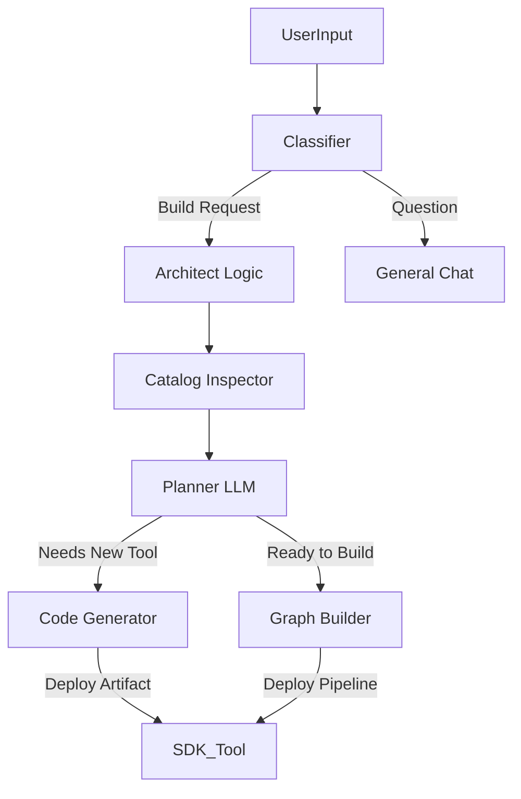

# Platform Architect Agent: Strategy & Design

## Vision
To build a "Meta-Agent" or "Architect Agent" capable of autonomously designing, building, and deploying RAG pipelines and Agents within the TalmudPedia platform. This agent serves as both a powerful feature for end-users and a proof-of-concept for the platform's extensibility ("Dogfooding").

## Core Philosophy
1.  **SaaS-Ready**: The agent must not rely on local filesystem access. It must operate entirely through the Platform APIs.
2.  **Self-Extending**: The agent should be able to write new Python code (via the SDK) to extend the platform's capabilities on the fly.
3.  **Introspective**: The agent uses the SDK to "see" what capabilities are available in the current environment.

## Implementation Architecture

The Architect Agent is implemented **as a standard Agent** within the platform, utilizing a specialized "SDK Tool".

### 1. The "SDK Tool" (Core Artifact)
We will create a single, powerful Artifact tool (`builtin/platform_sdk`) that wraps the Dynamic Python SDK, eliminating the need for the LLM to understand the raw REST API.

**Capabilities Exposed:**
- `fetch_catalog()`: Returns list of all available nodes (RAG & Agent).
- `create_custom_node(name, code)`: Uses `ArtifactBuilder` to register new logic.
- `deploy_rag_pipeline(graph_json)`: Deploys a RAG pipeline.
- `deploy_agent(graph_json)`: Deploys a new Agent.

### 2. The Agent Graph
The Architect Agent's graph will be designed as follows:

### MVP Graph (Now)
Because conditional routing and tool binding are not yet wired in the compiler/runtime, the MVP is **linear**:

`Start -> Tool(fetch_catalog) -> Agent(plan) -> Tool(execute_plan) -> End`

Key behaviors:
- The first Tool node calls `fetch_catalog` and writes a summarized catalog into `state.context`.
- The Agent node produces **strict JSON** (action + steps) and stores it in `state.state.last_agent_output` (and now also writes to `state.context` to remove ambiguity).
- The second Tool node reads `last_agent_output` (explicit `input_source: last_agent_output`) and executes the plan.

### 3. Step-by-Step "Dogfooding" Plan

#### Phase 1: The Core Tooling
1.  **Draft the Artifact**: Create a Python script `backend/artifacts/sdk_wrapper.py` that imports `backend.sdk` and exposes a `run()` function accepting commands (`list`, `create`, `deploy`).
2.  **Register as Tool**: Use the Platform Admin UI (or API) to register this artifact as a Tool named "Platform SDK".

#### Phase 2: The Agent Definition
1.  **Create Agent**: Create a new Agent "Talmud Architect".
2.  **Prompt Engineering**:
    *   *System Prompt:* "You are an expert Solutions Architect for the TalmudPedia platform. You have access to a verified SDK Tool that controls the platform..."
    *   *Instructions:* "Always check the catalog first. If a user needs X and it doesn't exist, write the Python code for X and deploy it using `create_custom_node`."

#### Phase 3: Validation (SaaS Proof)
1.  **Scenario**: "I want a pipeline that fetches stock prices from Yahoo Finance and summarizes them."
2.  **Execution**:
    *   Agent checks catalog -> No "Yahoo Finance Source".
    *   Agent writes `yahoo_finance_source.py` code.
    *   Agent calls `SDK_Tool.create_custom_node(...)`.
    *   Agent now sees "Yahoo Finance Source" in catalog.
    *   Agent builds pipeline connecting `YahooReader` -> `Summarizer`.
    *   Agent deploys pipeline.

## Why this fits SaaS & On-Prem
*   **On-Prem**: The Agent runs locally, hitting `localhost:8000`. The SDK connects to `localhost`.
*   **SaaS**: The Agent runs in your cloud worker. The SDK connects to `api.talmudpedia.com` (or internal service DNS). The `create_custom_node` endpoint writes to the DB/Registry, which propagates to all workers. No file writing required.

## Constraints (Current)
- **Conditional routing is not wired** in the agent compiler. If/Else and While nodes won’t route correctly yet.
- **LLM tool binding is not implemented** in the Agent node. Tools must be invoked through explicit Tool nodes.
- **RAG catalog endpoint requires auth**, so the SDK Tool must include a valid bearer token to see private catalog entries.

## MVP Now vs Future
**MVP Now**
- Linear graph flow only.
- SDK Tool handles catalog fetch and plan execution.
- Tool input fallback via `state.state.last_agent_output` (and last-message JSON parsing when needed).
- Seeded system tool and architect agent on startup (with legacy DB fallbacks).

**Future**
- Native LLM tool binding and tool-call routing.
- Conditional / approval steps in the planner loop.
- Multi-agent collaboration (agents calling agents as tools).

## Current Implementation Status (MVP)
- Added the `builtin/platform_sdk` artifact (YAML + handler) with actions: `fetch_catalog`, `execute_plan`, and `respond`.
- Implemented input resolution order for the SDK Tool: `context.inputs` -> `state.context` -> `state.state.last_agent_output` -> last message text.
- Added tool executor support for `input_source: last_agent_output` and last-message JSON parsing.
- Added `write_output_to_context` support in the Agent executor so planner JSON reliably becomes tool input.
- Added SDK client support for optional `tenant_id` and `extra_headers` (sets `X-Tenant-ID`).
- Added startup seeding for the Platform SDK tool and Platform Architect agent (ORM path + legacy SQL fallback).
- Added unit and integration tests covering tool input handling and SDK tool behavior.

## Verified
- Unit tests pass:
  - `backend/tests/test_tool_executor_input.py`
  - `backend/tests/test_platform_sdk_tool.py`
- Integration test suite exists (`backend/tests/test_platform_architect_integration.py`), but needs a re-run after the `write_output_to_context` change to confirm that `execute_plan` is invoked.
- Local startup previously hit schema mismatches (`tool_registry.status` missing / enum value for scope). Legacy seeding fallback was added; requires verification against the target DB.

## Next Steps
1. **Re-run integration tests** to confirm end-to-end `fetch_catalog -> plan -> execute_plan` behavior.
2. **Validate seeding on the target DB** (and apply migrations if needed, e.g., `tool_registry.status` / scope enums).
3. **Manual smoke test**:
   - Fetch catalog -> planner JSON -> execute_plan.
   - Pure question -> `respond` with no mutations.
   - `dry_run: true` skips mutations.
