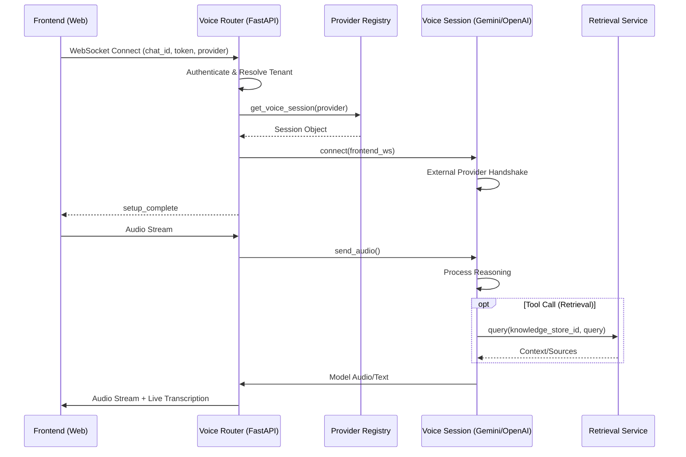

# Voice Mode Architecture

The Voice Mode in TalmudPedia provides real-time, low-latency Speech-to-Speech (S2S) capabilities. It is designed to be **provider-agnostic**, allowing the platform to support multiple AI voice engines (e.g., Gemini Live, OpenAI Realtime) through a unified interface.

---

## 🏗️ Technical Architecture

The voice system is built on three main layers:

### 1. WebSocket Entry Point (`voice_ws.py`)
- Located at: `app/api/routers/voice_ws.py`
- Handles the initial handshake, authentication, and chat session creation.
- **Tenant Context**: Automatically resolves the `tenant_id` from the user's organization membership to ensure strict multi-tenant isolation.
- **Provider Selection**: Dispatches to the correct voice backend based on the query parameter (e.g., `?provider=gemini`).

### 2. Provider Registry (`services/voice/`)
- **Base Class (`base.py`)**: Defines `BaseVoiceSession`, the contract that all voice providers must implement (connect, send_audio, send_user_text, etc.).
- **Registry (`registry.py`)**: A central store where providers register themselves. This decouples the API router from specific implementation details.

### 3. Provider Implementations
- **Gemini Session (`gemini_session.py`)**: Implements the Google Gemini Multimodal Live API.
- Handles complex tasks like:
    - Real-time audio streaming (PCM 16k).
    - Transcription synchronization.
    - **Tool Calling Integration**: Seamlessly connects to the `RetrievalService` to search the **Knowledge Store** using natural language queries generated by the voice model.

---

## 🔄 Sequence Flow

---

## 🗄️ Data Persistence

All voice interactions are persisted in the PostgreSQL database:
- **Chats**: Created with a `tenant_id` and optional `user_id`.
- **Messages**: Automatically indexed and categorized. Audio transcriptions are merged into the message content for history context.
- **Metadata**: Citations and reasoning steps from voice-triggered tool calls are stored in the message `tool_calls` field.

---

## 🛠️ Adding a New Provider

To add a new voice provider (e.g., OpenAI Realtime):
1. Create a new file in `app/services/voice/openai_session.py`.
2. Inherit from `BaseVoiceSession`.
3. Implement the abstract methods.
4. Register the provider: `VoiceProviderRegistry.register("openai", OpenAIVoiceSession)`.
5. Import the session in `app/services/voice/__init__.py` to trigger registration.
