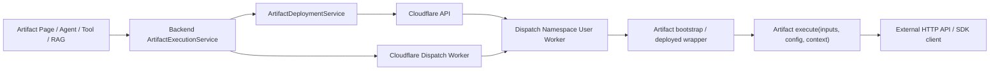
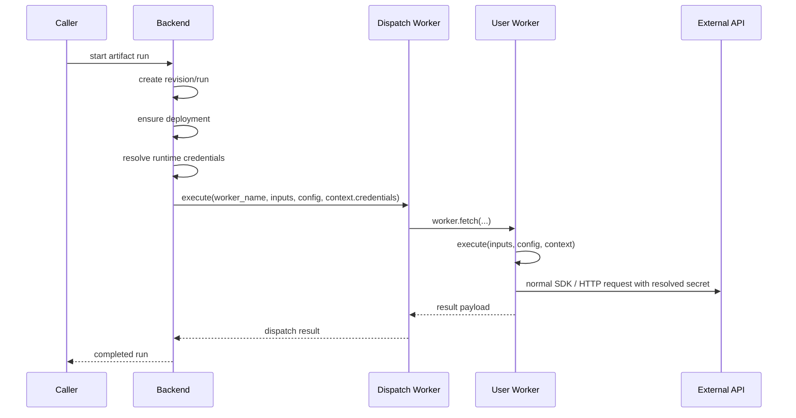

# Artifact Execution Current State

Last Updated: 2026-03-25

This document is the canonical current-state architecture overview for artifact execution.

## Purpose

Artifact execution now has one shared runtime path used by:
- artifact test runs
- artifact-backed tools
- agent artifact nodes
- RAG artifact-backed operators

This document describes the implemented architecture.

## Current Runtime Shape

The current execution path centers on:
- `ArtifactExecutionService`
- `ArtifactRevisionService`
- `ArtifactRunService`
- `ArtifactDeploymentService`
- `CloudflareArtifactClient`
- `CloudflareDispatchClient`
- `runtime_secret_service`

The current backend supports:
- revision-backed execution
- source-tree revision packaging and build-hash computation
- deployment resolution and reuse by namespace + build hash
- artifact run/event persistence
- Cloudflare Workers for Platforms dispatch for tenant artifacts
- one canonical runtime contract: `execute(inputs, config, context)`
- two artifact language lanes:
  - `python`
  - `javascript`

## Current Execution Surfaces

### Test runs

Artifact admin test runs use `ArtifactExecutionService.start_test_run()`.

Current behavior:
- resolve saved draft/published revision or materialize an ephemeral revision from request source files
- resolve or create a `staging` deployment by build hash
- create run and initial events
- pass `input_data` through as the worker `inputs` payload without wrapping it under `value`
- dispatch through the Cloudflare Dispatch Worker eagerly or through Celery depending on queue mode
- when eager local/test execution fails after the run row is created, return the failed run id/status instead of surfacing only a transport-level HTTP 500

### Live agent execution

Agent artifact execution already calls `ArtifactExecutionService.execute_live_run()` for tenant artifact revisions.

### Live tool execution

Artifact-backed tools already call `ArtifactExecutionService.execute_live_run()` and require published immutable revisions in production execution mode.

### Live RAG execution

Artifact-backed RAG operators already call `ArtifactExecutionService.execute_live_run()`.

## Current Runtime Flow

1. resolve an artifact revision
2. create an artifact run record
3. persist initial run events
4. resolve or create a Cloudflare deployment in `staging` or `production`
5. generate a language-specific Worker project and deploy it into the matching Cloudflare dispatch namespace
6. validate source-level credential refs and rewrite exact `@{credential-id}` string literals at deploy time into `context.credentials[...]`
7. store referenced credential ids on the revision manifest
8. resolve current credential values at run time and inject them into `context.credentials`
9. send a dispatch request to the Cloudflare Dispatch Worker
10. Dispatch Worker routes to the per-revision User Worker
11. User Worker executes deployed code and runs `execute(inputs, config, context)`
12. persist final run state and ordered run events

## Current Debugging Surface

Artifact execution debugging currently relies on the persisted run row plus ordered run events.

Current guarantees:
- dispatch HTTP failures are persisted onto `artifact_runs.error_payload`
- Cloudflare dispatch detail payloads are retained when the worker returns structured JSON error detail
- eager artifact test-run creation returns the persisted failed run so callers can inspect `/admin/artifact-runs/{run_id}` and `/admin/artifact-runs/{run_id}/events`
- artifact coding-agent test tools expose the latest test run's ordered event trail alongside `result_payload`, `error_payload`, stdout/stderr excerpts, and runtime metadata

## Worker Topology

The current runtime uses three layers:
- backend control plane
- Cloudflare Dispatch Worker
- per-revision Cloudflare User Worker inside a dispatch namespace

Current dispatch namespaces are:
- `staging`
  - author/test traffic
- `production`
  - live published traffic

Current runtime package shape for each artifact revision includes:
- a generated bootstrap/wrapper module
- a generated `wrangler.toml`
- Python lane:
  - `pyproject.toml` used by `pywrangler`
- JS lane:
  - `package.json`
  - pinned `nodejs_compat`
  - pinned compatibility date

## High-Level Graph

## Sequence

## Credential Flow

Current credential flow for artifacts is deploy-time rewritten and run-time injected:
- artifact source files can contain source-level credential references such as `@{credential-id}`
- only exact string-literal values equal to `@{credential-id}` are supported
- save/publish stores referenced credential ids on the revision manifest
- deploy/build rewrites those literals into `context.credentials[...]`
- raw credential values are not persisted in artifact source, deployed source, run config, run context, run events, or saved revisions

## Current Worker/Queue Model

Current queue classes in the system include:
- `artifact_prod_interactive`
- `artifact_prod_background`
- `artifact_test`

Current intent:
- `artifact_test`
  - artifact admin test runs only
- `artifact_prod_interactive`
  - live user-facing work such as agent turns, artifact-backed tool calls, and inline retrieval/runtime execution
- `artifact_prod_background`
  - standalone pipeline jobs and other non-user-blocking artifact workloads

Current namespace/runtime choices include:
- `staging` namespace for artifact-page author testing
- `production` namespace for live published execution
- synchronous dispatch for `artifact_prod_interactive`
- Celery-dispatched background execution for queued workloads

## Current Limits

The artifact runtime is implemented, but still V1.

Areas still evolving:
- stronger worker scheduling/fairness controls
- stronger end-to-end deployment/integration coverage
- more runtime-secret ergonomics for multi-field credentials

Important current reality:
- queue fairness still relies on queue classes and worker consumption behavior
- there is not yet a separate platform scheduler enforcing stronger tenant-level fairness inside a queue class
- Python artifacts are constrained to a Workers-compatible Python / Pyodide model
- JS artifacts run as Cloudflare Workers with `nodejs_compat` and a pinned compatibility date
- direct runtime secret access is now part of the artifact contract because artifacts and credentials are user-owned
- `artifact_runtime_sdk` is no longer part of the public credential contract
- Python dependency support now follows Cloudflare's official `pywrangler` pipeline and therefore inherits Workers Python / Pyodide package constraints
- the `pywrangler` pipeline itself is working for lightweight Python workers, but package compatibility is still narrower than normal server Python
- the `openai` Python SDK currently imports too heavily for this runtime and should not be treated as a supported artifact dependency
- artifact dependency analysis now uses a backend-owned registry to distinguish:
  - built-in imports
  - platform-verified runtime-provided imports
  - Pyodide catalog imports
  - declared dependencies
- only the platform-verified runtime-provided set suppresses dependency lint by default; broader Pyodide catalog entries are visible in the dependency table but still require explicit declaration unless promoted into the verified set
- the admin artifact config surface now derives dependency rows from current source imports plus declared dependencies instead of treating dependencies as a raw CSV-only field
- Python dependency adds in the admin UI now verify package existence against PyPI before adding a declared dependency

## Canonical Implementation References

- `backend/app/services/artifact_runtime/execution_service.py`
- `backend/app/services/artifact_runtime/revision_service.py`
- `backend/app/services/artifact_runtime/run_service.py`
- `backend/app/services/artifact_runtime/deployment_service.py`
- `backend/app/services/artifact_runtime/cloudflare_client.py`
- `backend/app/services/artifact_runtime/cloudflare_dispatch_client.py`
- `backend/app/services/artifact_runtime/cloudflare_package_builder.py`
- `backend/app/services/artifact_runtime/runtime_secret_service.py`
- `backend/app/workers/artifact_tasks.py`
- `runtime/cloudflare-artifacts/dispatch-worker/`
