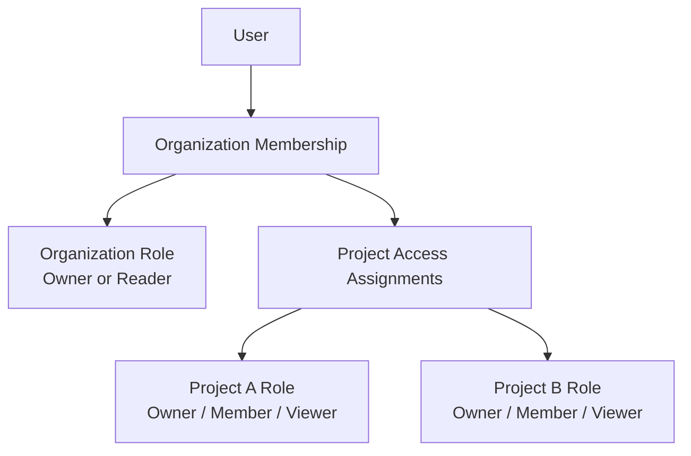
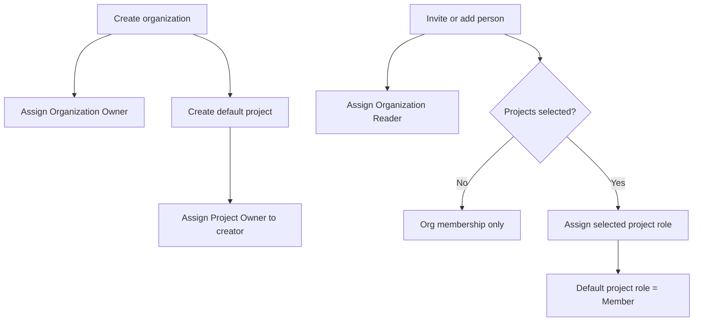
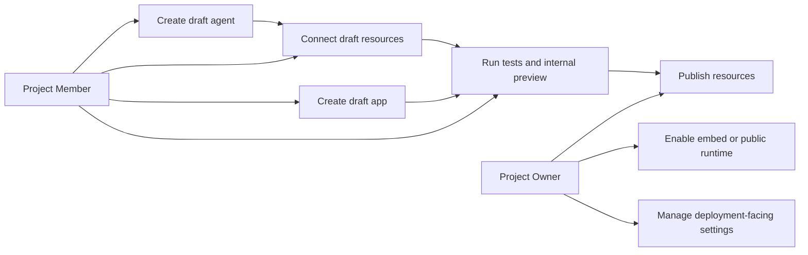
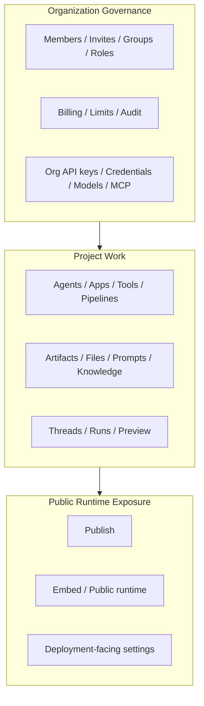

# People Permissions Roles Spec

Last Updated: 2026-04-20

This document is the canonical product spec for organization roles, project roles, membership defaults, and role-assignment behavior inside `People & Permissions`.

For the top-level settings IA and API list, see:

- `docs/product-specs/settings_hub_spec.md`
- `docs/product-specs/organization_and_project_workflow_spec.md`

## Purpose

This spec defines:

- the role families shown in `People & Permissions`
- the meaning of each default role
- how organization membership and project membership relate
- what gets assigned by default during org creation, invites, and project access changes
- how the UI should present these concepts without exposing raw RBAC internals

## Core Model

There are two role families:

- `Organization roles`
- `Project roles`

They serve different purposes:

- organization roles govern organization-level administration
- project roles govern work inside a single project

These role families must remain separate. A role belongs to exactly one family and must not mix organization-governance permissions with project-runtime permissions.

## Authorization Architecture

- WorkOS is the identity and session provider, not the long-term source of truth for product authorization.
- WorkOS owns:
  - login and session lifecycle
  - SSO / SCIM / directory identity
  - organization membership lifecycle events
- Talmudpedia owns:
  - organization roles
  - project roles
  - custom roles
  - role assignments
  - effective permission resolution
  - enforcement for control-plane operations
- Control-plane authorization is resolved from the local Talmudpedia role model.
- WorkOS role or permission payloads must not be used as the runtime source of truth for control-plane authorization.
- WorkOS membership events may still create, update, or remove local membership state, but authorization decisions remain local.

## Role Families

### Organization Roles

- `Owner`
  - Full organization governance.
  - Can manage organization settings, members, projects, roles, billing, limits, audit access, and other org-wide controls.
- `Reader`
  - Baseline organization membership.
  - Can appear in the org, read basic org-level data needed for membership presence, and receive project access.
  - Cannot manage organization members, roles, billing, or organization settings.

### Project Roles

- `Owner`
  - Full control of a specific project.
  - Can manage project settings and project members.
  - Can publish and externally expose project outputs.
- `Member`
  - Standard working role for a specific project.
  - Can read, create, update, run, and preview project resources.
  - Cannot manage project members.
- `Viewer`
  - Read-only access to a specific project.

## Assignment Model

- Every org member has exactly one organization role.
- A user may belong to the organization without belonging to any project.
- A user may belong to multiple projects.
- A user has at most one project role per project.
- Project membership requires organization membership.
- Project access is explicit, not inherited from `Reader`.

## Default Assignments

- Organization creator receives `Organization Owner`.
- Project creator receives `Project Owner` for that project.
- A newly invited or added org member receives `Organization Reader`.
- When a user is added to a project and no explicit project role is chosen, the default is `Project Member`.

## Inheritance And Overrides

- `Organization Reader` does not grant implicit access to any project.
- `Organization Owner` has organization-wide governance authority and can manage any project, even if no explicit project-role row exists.
- The UI may show this org-owner project power as inherited or implicit access, but the product model must not require explicit per-project assignments for org owners.
- Explicit project roles still control non-owner users.

## Draft Build And Publish Model

Project roles must not block a normal builder from creating a complete product inside one project.

`Project Member` can:

- create and edit draft agents
- create and edit draft apps
- create and edit draft tools, artifacts, prompts, pipelines, and other project resources
- connect draft resources to each other inside the same project
- run tests and internal previews

Draft composition is allowed inside the same project. Examples:

- draft app -> draft agent
- draft agent -> draft tools
- draft tool -> draft artifact
- draft pipeline -> draft knowledge resources

`Project Owner` controls the externalization lifecycle:

- publish project resources
- enable public or embedded runtime exposure
- manage deployment-facing project settings
- manage project members

Canonical rule:

- `preview mode` allows compatible draft dependencies inside the same project
- `published mode` requires published-compatible dependencies
- `Project Member` can build and preview end to end
- `Project Owner` can promote that work to externally exposed runtime surfaces

## Invite And Add-People Flow

The add/invite flow should optimize for the common case of inviting collaborators to work.

Default invite behavior:

- the invite always creates organization membership
- the default organization role is `Reader`
- the invite modal includes a role select for project access
- that role select defaults to `Member`
- if one or more projects are selected, the chosen project role is applied to each selected project

V1 invite simplification:

- one shared project-role selection may be applied to all selected projects
- per-project role overrides are out of scope for V1

If no project is selected:

- the invite creates only organization membership
- the user lands as `Organization Reader` with zero project access

## Member Management UI

`People & Permissions` remains a single surface. The split is expressed inside the surface, not as separate top-level settings tabs.

Member rows should show:

- organization role
- project access summary

Member detail UI should separate:

- `Organization role`
- `Project access`

The product language should use:

- `Organization role`
- `Project role`
- `Project access`

The UI should not expose raw storage terms such as `scope_type` or `scope_id`.

## Roles UI

The `Roles` tab remains a single tab, but it is split into two sections:

- `Organization Roles`
- `Project Roles`

Each section must clearly label:

- preset roles
- custom roles
- which targets they can be assigned to

Custom roles, if enabled, must declare exactly one family:

- `organization`
- `project`

Assignment flows must only show roles that are compatible with the current target.

## Custom Roles In V1

Custom roles are in scope for V1.

V1 custom-role rules:

- every custom role belongs to exactly one family: `organization` or `project`
- preset roles remain immutable
- custom roles are editable and deletable
- default system assignments still use preset roles
- custom roles may be assigned explicitly
- one org member has exactly one org role at a time
- one project member has exactly one project role per project at a time
- multi-role stacking within the same org scope or project scope is out of scope for V1

### Preset Role Immutability

Preset roles are product anchors and migration anchors.

In V1:

- preset roles cannot be renamed
- preset roles cannot be edited
- preset roles cannot be deleted
- custom roles are the extension point for tenants that need finer control

### Default Role Rules With Custom Roles

Custom roles do not replace the system defaults.

Default assignments remain:

- org invite or org add -> preset `Reader`
- project add without explicit selection -> preset `Member`
- organization creator -> preset `Owner`
- project creator -> preset `Owner`

Custom roles may be selected explicitly during assignment, but they are not the fallback defaults for system flows in V1.

## Canonical Behavioral Rules

- Organization membership is the parent relationship.
- Project access is a child relationship under organization membership.
- Removing organization membership removes all project access under that organization.
- Removing project access must not remove organization membership.
- An org member must always retain exactly one organization role.
- A project member must always retain exactly one project role for that project.
- `Owner` is never the default invite role.

## Permission Matrix

This section defines the intended product-level permission split. It is the canonical reference for what each default role can do.

### Organization Role Matrix

#### Organization Owner

Can:

- manage organization settings
- manage organization members and invitations
- manage governance groups
- manage organization and project role definitions
- create projects and archive projects
- manage billing, limits, and audit access
- manage organization-level API keys
- manage organization-level credentials, integrations, model/provider bindings, and MCP server configuration
- exercise organization-wide governance over any project

#### Organization Reader

Can:

- belong to the organization
- read basic organization information needed for normal membership presence
- see projects they have access to
- receive project access assignments

Cannot:

- manage organization settings
- manage members, invites, groups, or roles
- create or archive projects
- view billing, limits, or audit logs
- manage organization API keys
- manage credentials, integrations, models, or MCP server configuration

### Project Role Matrix

#### Project Owner

Can:

- manage project settings
- manage project members
- manage project API keys
- manage project publishing and deployment-facing settings
- publish apps, agents, tools, artifacts, and other project outputs where publish is supported
- enable public or embedded runtime exposure
- create, edit, run, test, preview, and delete normal project resources

#### Project Member

Can:

- read project resources
- create and edit project resources
- run agents, tools, pipelines, and other project execution flows
- create and edit apps in App Builder
- connect draft resources together inside the same project
- run tests and internal previews
- create a complete draft product end to end inside the project

Cannot:

- manage project members
- manage project settings
- manage project API keys
- publish externally
- enable public or embedded runtime exposure
- change deployment-facing settings

#### Project Viewer

Can:

- read project resources
- inspect project configuration, drafts, and published state

Cannot:

- create or edit project resources
- run project execution flows
- create previews
- manage members
- manage project settings
- manage project API keys
- publish or expose resources externally

## Custom Role Permission Catalog

This is the canonical product-level permission catalog for custom-role design. The implementation may map these permissions to backend scopes, but the product model must preserve this separation.

### Organization Custom-Role Permissions

- `organization.settings.manage`
  - manage organization settings
- `organization.members.manage`
  - add, remove, and modify organization members
- `organization.invites.manage`
  - create, resend, and revoke invites
- `organization.groups.manage`
  - create, edit, and delete governance groups
- `organization.roles.manage`
  - create, edit, delete, and assign organization/project roles where applicable
- `organization.projects.manage`
  - create projects and archive projects
- `organization.billing.manage`
  - view and modify billing-related controls
- `organization.limits.manage`
  - view and modify org-wide limits
- `organization.audit.read`
  - view audit logs
- `organization.api_keys.manage`
  - manage organization-level API keys
- `organization.credentials.manage`
  - manage org-level credentials and integrations
- `organization.models.manage`
  - manage organization model/provider configuration
- `organization.mcp.manage`
  - manage MCP server configuration

### Project Custom-Role Permissions

- `project.resources.read`
  - read project resources
- `project.resources.write`
  - create and edit normal project resources
- `project.resources.delete`
  - delete normal project resources
- `project.execute.run`
  - run project execution flows
- `project.preview.use`
  - use internal previews and draft runtime flows
- `project.publish.manage`
  - publish project outputs
- `project.exposure.manage`
  - enable embed/public runtime exposure and related externalization settings
- `project.settings.manage`
  - manage project settings
- `project.members.manage`
  - manage project members
- `project.api_keys.manage`
  - manage project API keys

### Dangerous Permissions

These permissions are governance-sensitive and must remain explicit in the editor:

- `organization.members.manage`
- `organization.roles.manage`
- `organization.billing.manage`
- `organization.api_keys.manage`
- `organization.credentials.manage`
- `organization.mcp.manage`
- `project.members.manage`
- `project.api_keys.manage`
- `project.publish.manage`
- `project.exposure.manage`

These permissions must never be implied silently by cosmetic UI groupings.

## Custom Role Editor Model

The V1 custom-role editor should use a structured permission editor, not a raw backend-scope editor.

The editor should include:

- role name
- role description
- family selector: `Organization` or `Project`
- grouped permission checklist for the chosen family
- clear highlighting of dangerous permissions

The editor must enforce:

- organization-family roles can only use organization permissions
- project-family roles can only use project permissions
- family cannot drift after permissions are selected without reconciling invalid selections

Preset roles should be shown in the same surface, but clearly labeled as preset and non-editable.

## Assignment Rules For Custom Roles

Assignment behavior must stay simple in V1:

- organization-role assignment only shows organization-family roles
- project-role assignment only shows project-family roles
- assigning a new org role replaces the existing org role for that member
- assigning a new project role for a given project replaces the existing project role for that user in that project
- custom roles follow the same replacement model as preset roles

The product should avoid additive role stacking in V1 because it makes effective access hard to reason about and hard to explain in the UI.

## Resource Classification

The permission matrix should be interpreted through these product resource groups.

### Organization-Governance Resources

- organization settings
- members
- invitations
- groups
- roles
- projects directory and project creation/archive
- billing
- limits
- audit logs
- organization-level API keys
- credentials and integrations
- model/provider governance
- MCP server management

These are governed by organization roles.

### Project-Work Resources

- agents
- apps
- tools
- pipelines
- knowledge stores
- artifacts
- files
- prompts
- threads, runs, and previews
- project-specific settings
- project members
- project API keys

These are governed by project roles.

### Public And Runtime Exposure Resources

- published apps
- embedded/public agent runtime exposure
- external deployment and publish surfaces
- public runtime domains or equivalent customer-facing exposure settings

These are treated as project-level resources, but externalization authority belongs to `Project Owner`, not `Project Member`.

## Special Rules

- `Project Member` is intentionally allowed to build a full draft product end to end inside a project.
- `Project Viewer` is read-only and does not receive execution rights by default.
- Secrets and externally usable machine credentials are governance-sensitive and default to owner-controlled management.
- If a future workflow requires members to publish, that should be introduced as an explicit approval/promotion model, not by widening the default `Project Member` role.

## V1 Out Of Scope

- separate top-level tabs for org roles vs project roles
- per-project multi-role stacking
- hybrid roles that span organization and project families
- per-project invite-role overrides inside one multi-project invite flow
- exposing low-level RBAC scope editing in the normal add/invite flow
